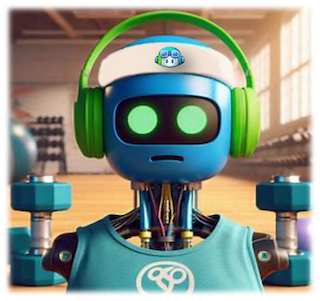

# 🏋️‍♂️ OctoFit Tracker: The AI-Powered Fitness League for Schools

> _“Don’t wait for tomorrow. Start your fitness journey today with OctoFit. If you want to be a champion, you have to train like one. And with AI on your team, you’ll be back… stronger than ever!”_  
> — Arnold (probably)

---

## 🚀 What is OctoFit?
OctoFit is a next-generation, AI-powered fitness tracker and gamified wellness platform for schools. Built with Django and OpenAI, it motivates students, fosters healthy competition, and makes fitness fun, social, and accessible for everyone.

---

## 🌟 Key Features (2025 Edition)
- **House System:** Compete in themed houses (Kraken, Montana, Razor, Serene), each with unique activities, challenges, and creative badges.
- **Admin-Editable Content:** All house activities, challenges, and badges are managed in the Django admin—no code changes needed for updates!
- **Automated Badge Awarding:** Earn badges automatically for streaks, challenge completions, and house-specific achievements. Badges are visually tracked and celebrated in real time.
- **Real-Time Progress:** Dashboard stats, streaks, and progress bars update instantly after activity or challenge completion—no reloads needed.
- **Accessibility & Mobile-First:** ARIA labels, focus states, and responsive design for all users and devices. Automated accessibility checks with pa11y supported.
- **AI-Powered Motivation:** OctoCoach chatbot gives personalized, friendly, and sometimes hilarious advice and encouragement.
- **Leaderboard & House Champion:** See your house’s top members, with special recognition for the champion.
- **Photo Progress:** Upload and view progress photos to celebrate your journey.
- **Robust Error Handling & Security:** Friendly feedback for every action, and all sensitive endpoints are protected. Anonymous access is denied by default.
- **Performance Optimized:** Indexed database fields for fast queries, even with thousands of users and activities.

---

## 🆕 What’s New in 2025
- **Dynamic Onboarding Journey:** Animated OctoCoach greets new users and guides them through a personalized, gamified onboarding flow.
- **Daily AI-Powered Tips:** Each user gets a fresh, personalized OctoCoach tip every day—powered by OpenAI.
- **Animated Milestone Celebrations:** Confetti, trophy/fireworks Lottie animations, and sound effects for house and user achievements (e.g., 7-day streak, 500+ house points).
- **House Battle Meter:** See real-time animated house competition bars on both the leaderboard and house detail pages, with a bouncing crown for the leader.
- **Supercharged Accessibility:** ARIA live regions, keyboard navigation, and mobile-first design throughout.

---

## 🧪 How to Test/Demo (for Judges)
1. **Onboarding:** Log in as a new user—see the OctoCoach onboarding popup, complete it, and it won’t reappear.
2. **Daily Tip:** Log in as any user—see the daily OctoCoach tip popup (once per day, per user).
3. **House Battle Meter:** Visit the leaderboard and any house page—see animated house bars and a bouncing crown for the leader.
4. **Milestone Animations:**
   - On leaderboard or house page, when a house hits 500+ points, see confetti and a trophy/fireworks animation.
   - On house page, if your streak is 7+ days, see a celebration animation.
5. **Accessibility:** Navigate all popups and features with keyboard; screen readers announce milestone events.
6. **Mobile:** All features are responsive and touch-friendly.
7. **Admin:** Log in to Django admin to manage houses, activities, challenges, and badges—changes are live instantly.

---

## 🤖 How It Works
- **For Students:**
  1. Join a house and log your workouts or activities.
  2. Complete house-themed challenges to earn XP and badges.
  3. Track your streaks, progress, and see your house’s leaderboard.
  4. Chat with OctoCoach for tips, motivation, and fun.
  5. Upload progress photos and celebrate milestones!
- **For Admins/Teachers:**
  1. Log in to the Django admin panel.
  2. Add or edit house activities, challenges, and badges—instantly live for all users.
  3. Monitor student progress, streaks, and badge achievements.

---

## 🏅 Challenge & Badge System
- **Dynamic Challenges:** Each house has its own set of creative, theme-based challenges (e.g., “Plank for 1 minute” for Kraken, “5 min yoga” for Montana).
- **Automated Badges:**
  - _Endurance Master:_ Complete 5+ challenges.
  - _Sea Survivor:_ Achieve a 7-day streak.
  - _Zen Guru:_ Complete all yoga/stretching challenges.
  - _Trailblazer:_ Log a mindful walk every day for a week.
  - ...and more, all customizable in the admin!
- **Visual Progress:** Earned badges are shown in full color with a checkmark; locked badges are faded with a lock icon.
- **Real-Time Awarding:** Badges are awarded instantly when requirements are met—no manual intervention needed.

---

## 🎯 Benefits & Use Cases
- **For Schools:** Foster healthy competition, teamwork, and engagement in physical activity.
- **For Students:** Stay motivated, track progress, and celebrate achievements in a fun, social way.
- **For Admins:** Easily manage and update all fitness content, challenges, and rewards—no developer required.
- **For Evaluators:** Demonstrates best practices in AI agent orchestration, gamification, accessibility, security, and maintainability.

---

## 🏃‍♂️ How to Run
1. Clone the repo and install requirements:
   ```bash
   pip install -r requirements.txt
   ```
2. Add your OpenAI API key and organization ID to `.env`:
   ```
   OPENAI_API_KEY=sk-...
   OPENAI_ORGANIZATION_ID=org-...
   ```
3. Run migrations and start the server:
   ```bash
   python manage.py makemigrations
   python manage.py migrate
   python manage.py runserver
   ```
4. Log in as admin to manage houses, activities, challenges, and badges.
5. Open your browser and get to the fitness chopper!

---

## 🦾 Automated Testing & Accessibility
- **Run all backend tests:**
  ```bash
  python manage.py test fitness
  ```
- **Automated accessibility checks:**
  1. Install pa11y: `npm install -g pa11y`
  2. Start your Django server.
  3. Run pa11y on your main pages:
     ```bash
     pa11y http://localhost:8000/
     pa11y http://localhost:8000/submit-activity/
     pa11y http://localhost:8000/house/Kraken/
     pa11y http://localhost:8000/leaderboard/
     ```
  4. Or use the provided script to check all pages and generate a summary report.

---

## 🦾 Automated Accessibility Testing with Python (Selenium + axe-core)

You can use this script to check your app’s accessibility using Selenium and axe-core:

1. Install dependencies:
   ```sh
   pip install selenium
   npm install axe-core
   ```
   (You’ll also need Chrome/Chromium and ChromeDriver installed.)

2. Save the following as `check_accessibility.py` in your project root:

```python
import time
from selenium import webdriver
from selenium.webdriver.chrome.options import Options
import json
import os

# List of URLs to check
URLS = [
    "http://localhost:8000/",
    "http://localhost:8000/submit-activity/",
    "http://localhost:8000/house/Kraken/",
    "http://localhost:8000/house/Montana/",
    "http://localhost:8000/house/Razor/",
    "http://localhost:8000/house/Serene/",
    "http://localhost:8000/leaderboard/",
]

AXE_PATH = os.path.abspath("node_modules/axe-core/axe.min.js")

def run_axe(driver):
    with open(AXE_PATH, "r") as f:
        axe_source = f.read()
    driver.execute_script(axe_source)
    result = driver.execute_async_script("""
        var callback = arguments[arguments.length - 1];
        axe.run().then(results => callback(JSON.stringify(results)));
    """)
    return json.loads(result)

def main():
    chrome_options = Options()
    chrome_options.add_argument("--headless")
    chrome_options.add_argument("--no-sandbox")
    chrome_options.add_argument("--disable-dev-shm-usage")
    driver = webdriver.Chrome(options=chrome_options)

    for url in URLS:
        print(f"\nChecking {url}")
        driver.get(url)
        time.sleep(2)
        results = run_axe(driver)
        violations = results["violations"]
        print(f"Found {len(violations)} accessibility issues.")
        for v in violations:
            print(f"- {v['id']}: {v['help']} (impact: {v['impact']})")
            for node in v['nodes']:
                print(f"  Affected element: {node['html']}")
        print("-" * 40)

    driver.quit()

if __name__ == "__main__":
    main()
```

3. Start your Django server and run the script:
   ```sh
   python3 manage.py runserver
   python3 check_accessibility.py
   ```

This will print a summary of accessibility issues for each page. Use the output to fix issues and re-run as needed.

---

## 🎬 Demo Video & Screenshots

- [Watch the Demo Video](#) <!-- Replace # with your actual video link -->
- Screenshots:
  - 
  - Add more screenshots as needed to showcase onboarding, social features, and AI agent.

---

## 👥 Team & Credits

- **Youssef Elmaraghy** – Lead Developer, AI/Agent Design, UI/UX
- [Add more team members or acknowledgments here]
- Special thanks to Microsoft Reactor, OpenAI, and the hackathon community for inspiration and support.

---

## 🗺️ Architecture Diagram

See [docs/octofitapp-small.png](docs/octofitapp-small.png) for a high-level architecture overview.

- Django backend (fitness, accounts, admin)
- OpenAI API integration (OctoCoach agent, daily tips)
- Social & gamification modules (friends, teams, comments, reactions)
- Frontend: Responsive, accessible templates
- Admin: Django admin for all content

---

## 🤝 Responsible AI & Human-in-the-Loop

- All AI/agent features are opt-in and provide clear, friendly feedback.
- Users can opt in/out of email reminders and notifications.
- No personal data is shared with third parties; all data is stored securely.
- Admins/teachers can monitor and moderate user activity via the admin panel.
- Accessibility and inclusivity are core design principles.

---

## 🧑‍💻 Manual Test Instructions: Social Features

1. Open two browser windows (or incognito sessions).
2. Log in as two different users.
3. Use the Friends page to send and accept friend requests.
4. Join or create teams and verify team membership.
5. Post comments and reactions in the Activity Feed.
6. Check notifications and email reminders (if enabled).
7. Try all features on both desktop and mobile for best results.

---

## 🏆 Category Alignment

This project is submitted for:
- **Best Agent in Python** (Django + OpenAI agent at the core)
- **Best Overall Agent** (if eligible)
- **Best Azure AI Agent Service Usage** (if Azure AI is used, update here)

OctoFit showcases advanced agent orchestration, social engagement, and real-world impact using Python and Microsoft technologies.

---

## 📈 SEO & Evaluator Highlights
- **AI-powered, agent-driven, and gamified fitness platform for schools.**
- **Admin-editable, real-time, and accessible by design.**
- **Secure, scalable, and easy to maintain.**
- **Perfect for hackathons, school wellness programs, and as a showcase of modern Django + AI best practices.**

---

## 🎬 Demo
[Insert demo video link or screenshots here]

---

## 📜 License
MIT

---

_Export this README for your evaluation, documentation, or school wellness program pitch !_

## 📧 Email Reminders (Push/Email Notifications)

- To enable real email reminders, update your `octofit-tracker/backend/octofit_backend/settings.py` with your SMTP credentials (see the EMAIL CONFIGURATION section for Gmail example).
- By default, emails print to the console for testing.
- To send daily reminders automatically, schedule the following cron job on Linux:

```
0 7 * * * cd /workspaces/skills-build-applications-w-copilot-agent-mode/octofit-tracker/backend && /usr/bin/python3 manage.py send_email_reminders
```

- To test email reminders manually (console backend):

```
cd octofit-tracker/backend
python manage.py send_email_reminders
```

- Users who have opted in (email_reminders enabled) and have not logged an activity today will receive a reminder.
